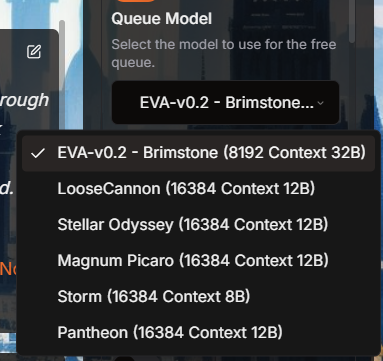
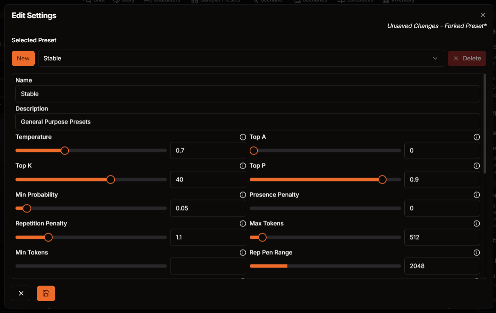

# Common Terms

Here’s a rundown of terms you might see around here – each one helps you get the most out of our features and understand how everything connects.

### AI Model

Also known as **LLM** or **Large Language Models**, they are the main technology behind WyvernChat’s responses. Models are built on massive datasets and trained to understand language patterns, so they can generate responses based on an input.

The **B** at the end of the model name indicates the **size of the model**. The higher usually the better but not always depending on how well it's trained. Each model has it's own quirks and personality, find out which one fits your style!

The **Context** here refers to the **context window**. The higher the context window usually the bigger the memory of the model at remembering past events.

### Token

AI doesn't break down every word or text into single letters, instead it can only understand tokens. Token is AI’s smallest unit of language, a token might be a full word or a fragment, depending on the language model's **Tokenizer**.

(todo insert token probability img when wyvern has it)

### Context Window

The context window is the amount of recent conversation or text that the AI can "remember" and use to inform its responses. It’s like a sliding window that moves forward with the conversation, holding onto only the most recent content up to a certain limit.

For example, if the context window is 2000 tokens, the AI will use only the last 2000 tokens to generate its reply. Anything beyond that limit is forgotten by the AI and no longer affects its responses.

### Prompt

A **prompt** is simply an input given to the AI to generate a response. It provides the starting point for the AI, guiding it on what to respond to, whether it’s a question, command, or any other type of text.

### Presets

**Presets** are saved settings that control how the AI responds in WyvernChat. They include various options like creativity, repetition, and randomness, which shape the style and behavior of the AI's replies. Presets are usually model specific and WyvernChat allows presets sharing.

### Temperature

A setting that controls the creativity of the AI's responses. Higher temperatures create more varied and imaginative replies, while lower temperatures make responses more straightforward and consistent.

### Slop

**Slop** (sometimes called **GPT slop** or **GPTism**) refers to those repetitive patterns and overly polite or formulaic responses often found in corporate AI models. It’s the reason some replies might feel “safe,” predictable, or have an unnatural tone that doesn’t quite match the flow of a real conversation.

### Fine-tune

**Fine-tune** is an extra training step that refines a base AI model to improve its performance for specific tasks or styles. For example, a **RP Fine-tune** (role-play fine-tune) adjusts the model specifically for conversational and character-driven interactions, making it more responsive and engaging in role-play scenarios. Fine-tuning is like specialized training that helps the AI align with particular needs, whether storytelling, role-play, or maintaining a consistent tone.

### Hallucination

**Hallucination** refers to when the AI generates information that isn’t based on the given context or is entirely fabricated. In storytelling or chat, this could mean the AI invents random plot points, facts, or character actions that don’t fit with what’s been established. Hallucinations happen because the AI sometimes "guesses" details rather than sticking strictly to provided information, leading to responses that might seem plausible but are actually off-topic or inaccurate.

###