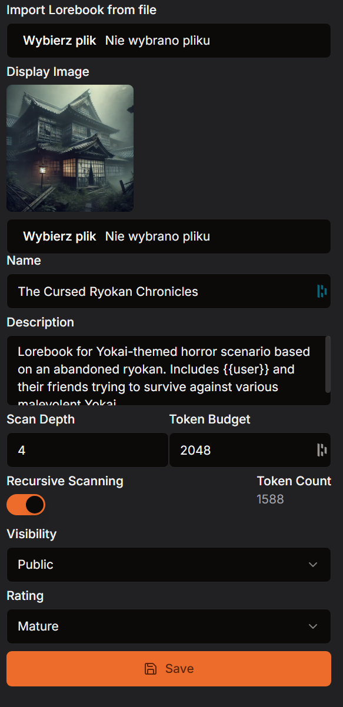
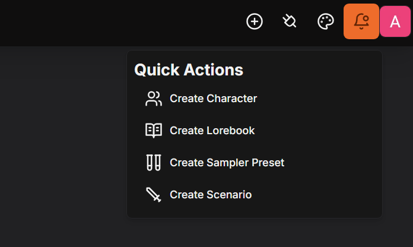
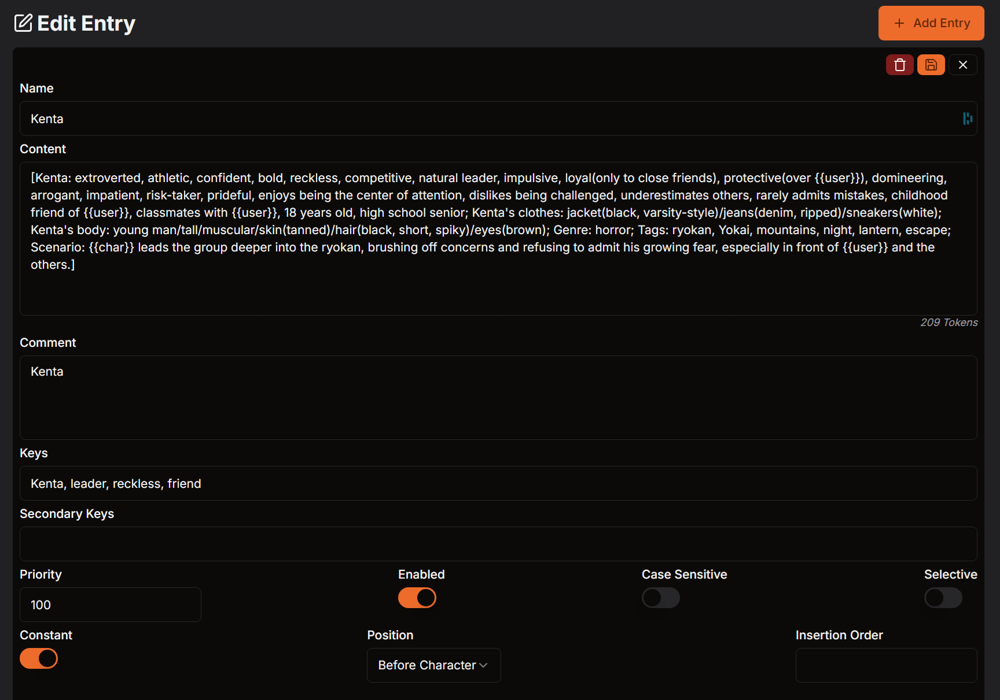
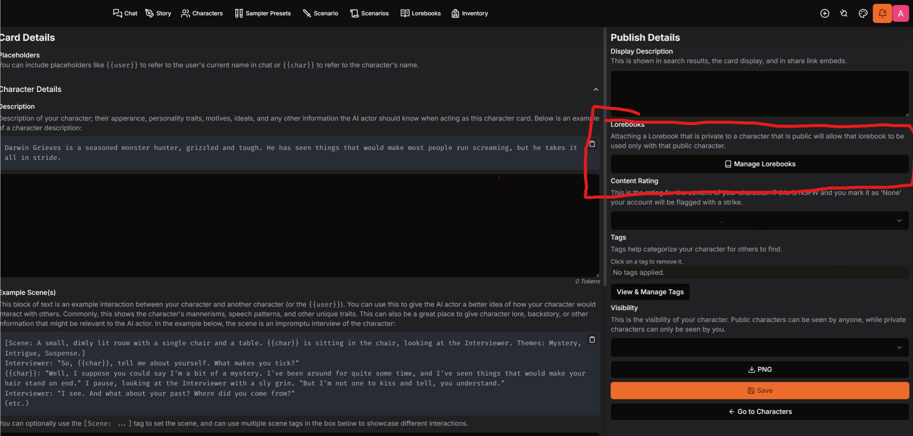
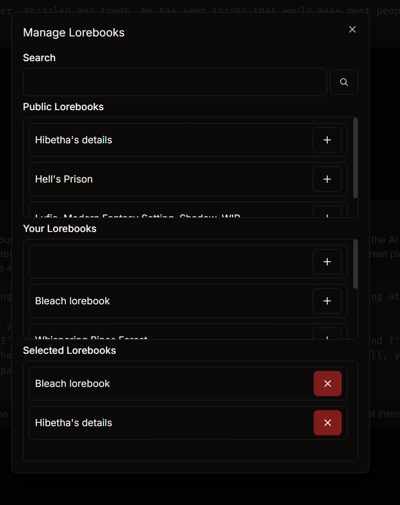

## What are Lorebooks?

Lorebooks are tools that allow users to define keywords or phrases, known as keys, that trigger specific entries to be added into a prompt. This feature is particularly useful for adding lore, character backstories, settings, or environmental details without having to hardcode them into the character definition, which helps manage the token limit.

By activating these entries when a key is mentioned in a chat, the Lorebook serves as a flexible and dynamic extension, enabling context-specific information to be surfaced only when necessary. For example, if a keyword like "sword" is defined, any time "sword" is mentioned in the prompt, the associated content will be inserted into the chat.

---

## Lorebook Settings in WyvernChat

  

    In **WyvernChat**, Lorebooks are attached during character creation. You can assign multiple Lorebooks to a single character to enrich the character's depth and interaction.

    **Here are the key settings you’ll need to understand when working with Lorebooks:**

    - **Import Lorebook from File**  
      Allows you to import an existing Lorebook from a file. This is useful for reusing previously created Lorebooks.

    - **Display Image**  
      An optional image that represents the Lorebook visually. It does not affect the Lorebook's function.

    - **Name**  
      The name of the Lorebook entry. This helps identify the Lorebook.

    - **Description**  
      A brief description of what the Lorebook contains.

    - **Scan Depth**  
      Defines how many past messages the system scans for keywords. A setting of "2" means it will check the last two messages for keywords, helping to keep the prompts relevant to recent interactions.

    - **Token Budget**  
      Sets the maximum number of tokens that Lorebook entries can use in a single prompt. If the total combined tokens of triggered entries exceed the set budget, only the highest-priority entries are included, while the rest are ignored.

    - **Recursive Scanning**  
      Enables or disables the feature that allows one Lorebook entry to trigger another. For example, if "Sword" in one entry mentions "Excalibur," and there's a separate Lorebook entry for "Excalibur," it will pull in that entry as well.
   
    - **Token Count**   
      How many tokens are in entire Lorebook. (Visible after first entry)

    - **Visibility**  
      Controls who can view the Lorebook. Options include:
      - **Public**: Anyone can access and use this Lorebook.
      - **Private**: Only the creator can access the Lorebook.

    - **Rating**  
      Sets the maturity level of the content:
      - **None**: Safe for all audiences.
      - **Mature**: Suitable for a 17+ audience without explicit content.
      - **Explicit**: Contains graphic content, including violence or adult themes.
  

  

    

    
  

---

## Creating a Lorebook in WyvernChat

In **WyvernChat**, creating a Lorebook is a straightforward process. Lorebooks are added during the **Character Creation** phase, and you can assign more than one Lorebook to a single character. Here’s how you can create and manage Lorebooks:

### Steps to Create a Lorebook

1. **Access the Lorebook Editor**  
   Click on + in the right corner of **WyvernChat**. Go to the **Create Lorebook**, then **Click Add Entry.**

   

2. **Fill in the Lorebook Entry Fields**  
   The editor presents several fields that allow you to configure the Lorebook entry. Here’s a breakdown of each field:

   

- **Name**  
  Name of the entry. You can leave it empty if you need.

- **Content**  
  The main body of the Lorebook entry. This is the text that will be inserted when the key(s) are triggered.

- **Comment**  
  An internal note for the creator. Comments are not visible to users or in prompts but can help keep track of each entry's purpose.

- **Keys**  
  Keywords - This is the most important aspect of a character book entry. These are the list of words that, when mentioned, insert the content into the prompt. They are separated by commas. For example: sword, Excalibur

- **Secondary Keys**  
  Additional keys that must also be mentioned for the entry to activate. These act as "selective" triggers, meaning both primary and secondary keys need to appear together. If you have a keyword of "Sword" and a secondary keyword of "Holy," then the content will only be inserted if both keywords can be found.

- **Priority**  
  Controls the order in which the entry is triggered when multiple entries are activated. Entries with a higher priority number will appear first.

- **Enabled**  
  Determines if the entry is active in the Lorebook. If disabled, the entry will not be pulled even if the keys are mentioned.

- **Case Sensitivity**  
  If enabled, keys will be case-sensitive. For example, "Sword" and "sword" would trigger different entries if this setting is on.

- **Selective**  
  Requires both the primary and secondary keys to be mentioned together for the entry to be triggered.

- **Constant**  
  If enabled, the content from this entry will always be inserted into the prompt, regardless of whether the key is mentioned.

- **Position**  
  Specifies where the entry will be placed relative to the character context. Options include:
  - **Before Character**: The entry will be inserted before the character's context in the prompt.
  - **After Character**: The entry will appear after the character context in the prompt.

- **Insertion Order**  
  Controls the placement of this entry relative to other entries. A lower insertion order number will place this entry higher in the prompt compared to entries with higher numbers.

3. **Save the Entry - Right Corner of Entry**  
   Once all the fields are filled out, click **Save** to store the entry. Your Lorebook entry is now ready to be used with your characters.

---

## Using Lorebooks in WyvernChat

Once you’ve created and saved your Lorebook entries, you can start using them in your chat interactions. In **WyvernChat**, Lorebooks are added during the **Character Creation** process, and multiple Lorebooks can be linked to a single character.

### Steps to Use Lorebooks

1. **Add Lorebooks to a Character**
   - Navigate to the **Character Creation** or **Character Edit** page.
   - Look for the section labeled **Lorebooks**.
   - Here, you can add one or more Lorebooks to the character.

   

2. **Activate Lorebooks in Chat**
   
   Click on Plus sign (+) next to lorebook to add it to character. It will be embedded to all chatlogs.
   Once you’ve assigned Lorebooks to a character, they will be automatically activated in the chat session when the corresponding keywords are mentioned.
   
   *You can add more than one Lorebook to character.*

   

---

## Quick Reference Guide

- **Display Image**  
  An optional field where you can add a custom image for each Lorebook entry. This image is purely for visual representation and does not impact the entry's function.

- **Name**  
  The name of the Lorebook entry. This helps identify the entry and can describe the type of content it holds, such as "Sword Lore" or "King Arthur."

- **Description**  
  A brief description of what the Lorebook entry contains. This field is optional and mainly for organizational purposes.

- **Scan Depth**  
  Defines how many past messages (including both your and the AI's responses) the system will check for triggering keywords. For example, setting it to "2" will make the system scan the last two messages.

- **Token Budget**  
  Sets the maximum number of tokens (units of text) that can be dedicated to this entry. The combined tokens of triggered entries cannot exceed the budget, so the system will prioritize which entries to include.

- **Recursive Scanning**  
  If enabled, this feature allows entries to trigger other entries. For example, if your "Sword Lore" entry mentions "King Arthur," and there is another entry for "King Arthur," it will also pull in that content.

- **Visibility**  
  Defines who can see the entry. You can set it to:
  - **Public**: Anyone can access and trigger this entry.
  - **Private**: Only the creator can access it.

- **Rating**  
  Controls the content rating for the entry. Options include:
  - **None**: Safe for all audiences.
  - **Mature**: Content that is appropriate for 17+ audiences but not explicit.
  - **Explicit**: Contains graphic details of violence, gore, or other adult themes.

- **Content**  
  The main body of the Lorebook entry. This is the text that will be inserted when the key(s) are triggered.

- **Comment**  
  An internal note for the creator. Comments are not visible to users or in prompts but can help keep track of each entry's purpose.

- **Keys**  
  Keywords that will trigger this entry when they are mentioned in the conversation.

- **Secondary Keys**  
  Additional keys that must also be mentioned for the entry to activate. These act as "selective" triggers, meaning both primary and secondary keys need to appear together.

- **Priority**  
  Controls the order in which the entry is triggered when multiple entries are activated. Entries with a higher priority number will appear first.

- **Enabled**  
  Determines if the entry is active in the Lorebook. If disabled, the entry will not be pulled even if the keys are mentioned.

- **Case Sensitivity**  
  If enabled, keys will be case-sensitive. For example, "Sword" and "sword" would trigger different entries if this setting is on.

- **Selective**  
  Requires both the primary and secondary keys to be mentioned together for the entry to be triggered.

- **Constant**  
  If enabled, the content from this entry will always be inserted into the prompt, regardless of whether the key is mentioned.

- **Position**  
  Specifies where the entry will be placed relative to the character context. Options include:
  - **Before Character**: The entry will be inserted before the character's definition in the prompt.
  - **After Character**: The entry will appear after the character context.

- **Insertion Order**  
  Controls the placement of this entry relative to other entries. A lower insertion order number will place this entry higher in the prompt compared to entries with higher numbers.
