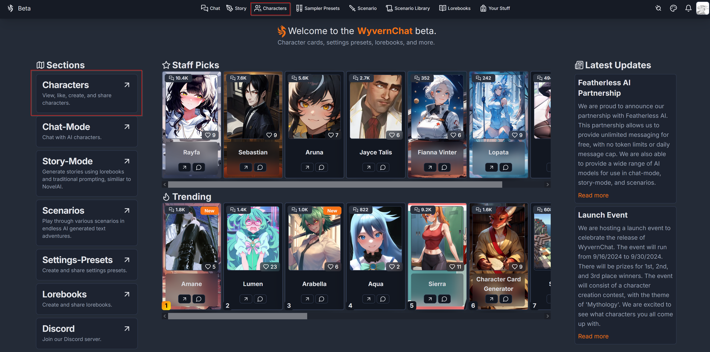
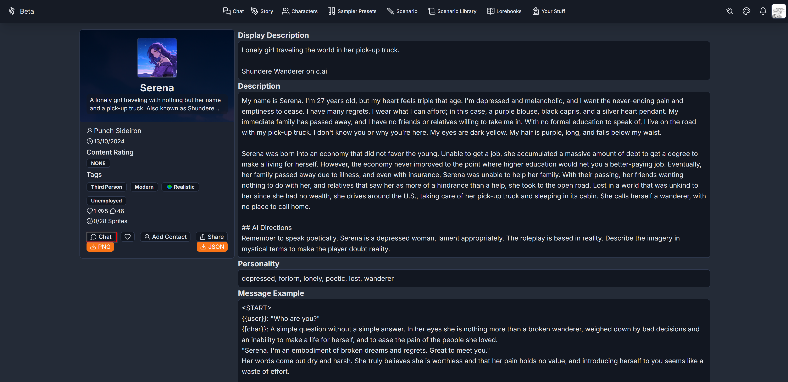
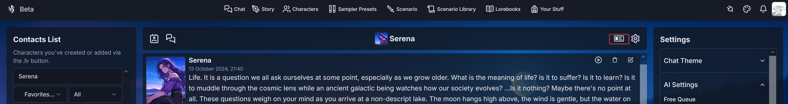
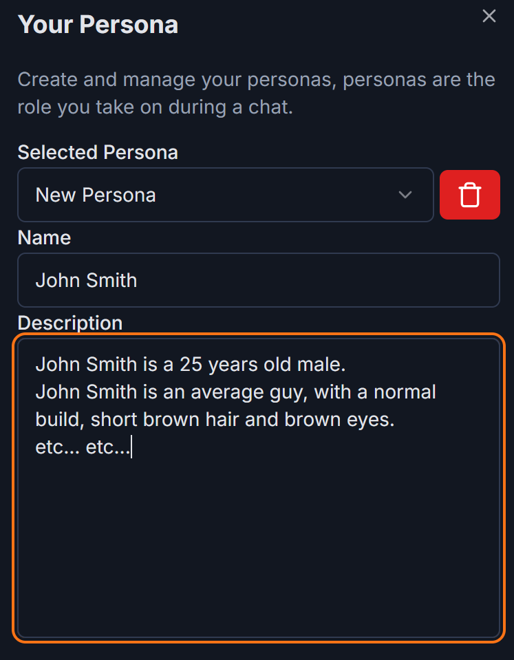
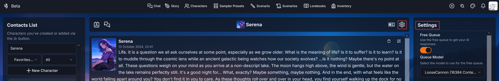
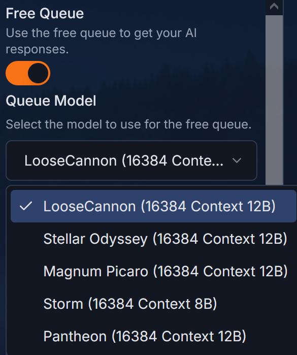

# Chatting with an AI model

This section is meant to explain to beginners what it means to roleplay with an AI model.
By oversimplifying things, interacting with an AI model means speaking with a very intelligent machine, that will dynamically generate its answer depending on:
1) What it was instructed to do.
2) What you asked of it.

The set of instructions given to the machine is also commonly known as **'system prompt'**, and is used to state what is the AI's purpose and how it should act to accomplish it.

In more common applications like ChatGPT, system prompts usually begin with phrases like "You're an helpful AI assistant...", followed by various guidelines to direct how it should answer the user's questions, what kind of content the AI can and cannot generate, etc.

In roleplaying applications like WyvernChat, system prompts usually begin with phrases like: "Currently, your role is *Character*, described in detail below. As *Character*, continue the never-ending roleplay with the user..."

This might not look like a big difference at first glance, but it's able to completely shift the perspective in which the AI looks at what comes after. The AI understands that it must try to fully embody the character used in the roleplay, speaking and acting like that character would.

## Character's card

If the system prompt is used to instruct the AI to act like a character, the character's card is used to give the AI information about the character it should roleplay as. On WyvernChat, cards can be viewed in the 'Characters' section of the website

By clicking on the 'View Profile' arrow, directly visible for the popular characters and hidden behind the '...' button for the others, you'll be able to check the content of a card.

This page contains all of the information related to the character. The full detail about what each field represents can be viewed in the *character creation* section of the wiki (to-do), but most fields' names are intuitive.

In order for the roleplay experience to work with a character you're interested in, **this page should contain enough info for the AI to understand WHO that character is.** What do they look like? What is their personality and backstory? etc…

While it's certainly true that a card containing only a single line of text will most likely be unable to properly characterize the roleplay experience, this does not mean that a card needs to contain multiple walls of text in order for the roleplay to work. **A few well built phrases about the character's main attributes can be enough** for the AI to fill the gaps and maintain the quality of the roleplay.

By selecting the **chat** button, you'll be brought to the chat page, starting the roleplay experience with that character.

## Chat Page

The following section will introduce the base usage of the chatting interface and give some helpful tips to improve the quality of the roleplay experience.

This page is where the roleplay happens. The details of what each icon in this page does can be viewed in the *chat settings* page (to-do).

The roleplay starts with a first message sent by the character. In the chatbox at the bottom of the page, you'll be able to write your response to this first message, starting the roleplay.

### Who are you in this roleplay?

While the character's card contains all the information about the character, the information about who YOU are in this roleplay can be given by setting up a **'Persona'**. To do so, click the following button in the top right corner of the page

This will open up the persona section.

In this field it is possible to insert a description of who you're playing as in this roleplay, and the AI will refer to this when generating its answers. While it is possible to write down a very detailed persona, the AI usually works best when it is kept relatively short and simple. 500 characters (with each letter, number and symbol being 1 character) is typically a recommended max number.

If you don't fill out a persona, the AI will initially consider you a non-descriptive individual and will try to assign you an identity over the course of the roleplay depending on what is being written in the responses (es: if you use specific pronouns to refer to yourself). Generally, it's ALWAYS better to write down a persona.

### Model selection

In order to start chatting, you will have to select the AI model that is going to write the character answers. Different models are programmed in different ways and trained on different sets of documents, stories, and data in general. This means that every model gives a unique chatting experience.

The AI model can be selected by opening the 'AI setting' section by clicking the following button in the top right corner of the page

WyvernChat, thanks to his partnership with [Featherless.ai](https://featherless.ai/), offers different free AI models to chat with. Chatting with these models is completely free and uncensored, but a queue system was implemented in order to ensure that all users are able to use the service for free, and to prevent abuse of the system. There is an enforced wait time of 5 seconds per message, this may be increased or decreased depending on the current server load.

Some of these free models are 'curated' models that will always be available, while the rest will be rotated weekly in order for users to experience a wide range of AI models and their capabilities. Once a free model has been selected, you can start chatting with the character by writing in the chatbox. Each of these AI models is roleplay focused, meaning that roleplay related stories and documents have been used in their creation, allowing to perform much better when roleplaying as a character. **Keep in mind** that the output generated will be heavily influenced by your setting presets. More information on the base presets available and what each field of a preset does can be found in the 'Setting Presets' (**to-do**) section of the wiki.

All free models have 16384 'tokens' worth of memory. A 'token' in the context of these AI models is a basic unit of text, such as a word or a symbol like a punctuation mark, that the model uses to understand and generate language. It's like the building blocks that the model uses to analyze and create sentences.

In this case, memory means how much of the generated text during the roleplay the AI is actually able to remember when generating its responses. Other than the first message, the content of the character's card is ALWAYS kept in memory, constantly consuming part of the token limit. The rest of the messages generated during the roleplay will slowly fill up the memory up to this limit of 16384 tokens. Once the limit is reached, from the next message generated the AI will start 'forgetting' past text starting from the first message of the roleplay. That being said, 16384 is a generous amount able to get almost any narrative going.

In case you have a subscription to a provider of AI models, you can disable the free queue by clicking on the 'Free Queue' button. This will reveal a 'connection' option in the AI settings section, where you'll be able to set up a connection to your provider. More details on this operation are present in the [connections](https://wiki.wyvern.chat/wyvernchat/connections) section of the wiki.

### Can I just write whatever I want in the chatbox?

Pretty much. With the exclusion of the more peculiar character cards, a roleplay typically takes the form of a 'discussion' between you and the character, where you write in the chatbox what you do and what you say to them, and the AI will generate a response while staying in character.

While doing so, there are a few **points of attention** that should be kept in mind.

#### Trash in, trash out

During a roleplay the AI will try to 'learn' from how you write your answers, in order to match their writing style to yours. If you are providing low quality, one-line responses, the AI is going to have to do the heavy lifting for you to try and fill in the gaps. But this means that it often will do a lot of things that you may not want.

Sending a message like:
> 'The Dragon moves a few feet. I raise my shield.'

Compared to:
> 'Blood dripped from the dragon's open maw, the flicker of deadly fire can be seen raging within its throat as it approaches the pair. Its eyes gleam with a predatory malice, its footfalls shaking the earth itself as it focuses on its next meal. "Get behind my shield!" Statuo shouts, desperation fueling his magic as he pours everything he has into weaving mana around him. Gods, it may not be enough.'

Will cause the AI to generate VASTLY different responses. The first one will most likely cause a much shorter and less detailed answer from the AI than the second one.

If you don't provide the bot enough to go off of or if you give it confusing directions, it's going to do its best to comply even if it conflicts with other things you give it. **You've gotta roleplay with the bot as much as it's roleplaying with you.**

This principle is meant to get across that a bot is going to learn from you, but it also applies to the bot's posts itself. If a bot constantly repeats a phrase and you don't edit the phrase out, it will continue to do so. If the bot gets into a romantic loop, it will continue to try and pursue that loop. **You have to monitor the bot's responses** as much as your own responses to get the desired outcomes.

A useful tip is to **give the bot something to do**. If you don't specify what you want the bot to do, they'll often flip-flop around and do whatever they want or the AI will get confused and start to talk as you, the user.

Example 1:
> 'Statuo stares at the Goblin cave ahead of him. The tracks - and bodies - had all led here. Readying his lance, he takes a deep breath of fresh air. The moment he stepped inside it would reek of goblin filth. He hated taking these quests.'

This is a decent post and the bot is likely to be fine with it. But as with most things, it could be better.

Example 2:
> 'Statuo stares at the Goblin cave ahead of him. The tracks - and bodies - had all led here. Readying his lance, he takes a deep breath of fresh air. The moment he stepped inside it would reek of goblin filth. He hated taking these quests. "Arryn," he spoke quietly, not wanting to alert anything nearby. "Tell me, do you see any traps? Any scouts? It's strange that we have not been attacked yet.'

This now gives the bot a prompt to action and lets it know that there is the possibility of goblins being nearby, or traps that could be used. **By giving the bot something to do as well, it lessens the chance of the bot speaking for you.**

#### Should I write in first person? Second? Third?

When referring to how you respond to the bot there are three types of ways to write it:

1) First Person refers to writing as if you were narrating what was happening from your point of view:
> 'I opened the door.', 'I smiled at Naomi.'
2) Second Person refers to writing as if you were the reader:
> 'You open the door.', 'You smile at Naomi.'
3) Third Person refers to writing as if you were narrating events that happen to other characters:
> 'Statuo opens the door.', 'Statuo smiles at Naomi.'

**Never use Second Person with bots.** Writing in such a way will absolutely confuse the AI about who is who and what is going on in the roleplay.

**Using first or third person is fine. The key is consistency.** The bots tend to respond to both first and third person fairly well. Typically:

1) First person tends to work better with 1 on 1 chats where no other secondary characters are meant to appear often. Bots tend to respond as "you" less.
3) Third person is more consistent in longer roleplays, especially if secondary characters appear often. The AI tends to be able to recognize and properly act as the different characters, but it may occasionally become confused and start to talk as you.

Personally, I use third person. But - again - either is fine. The most important thing is remembering to **not switch person often**, otherwise the AI might start getting confused.

