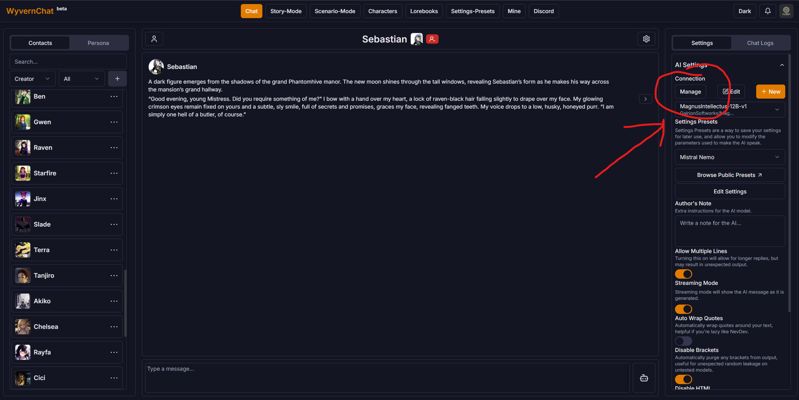
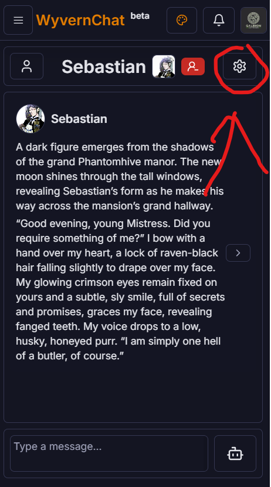
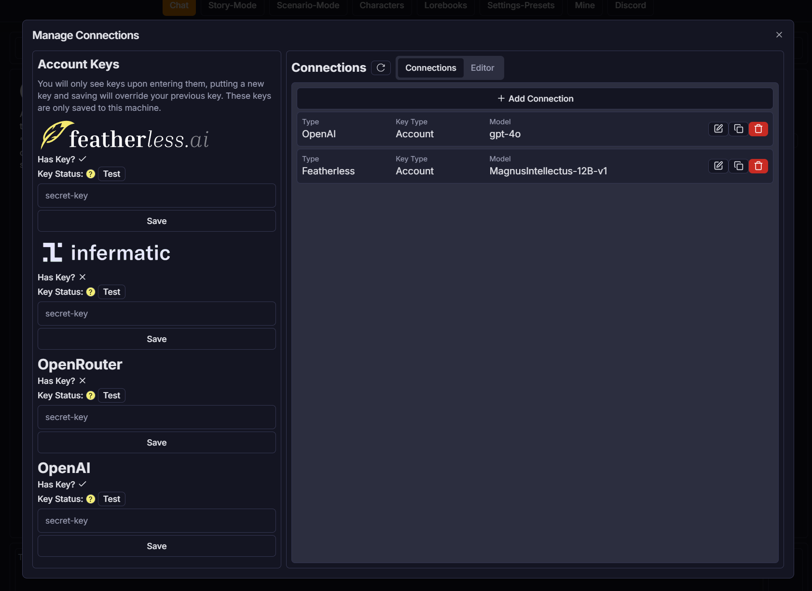
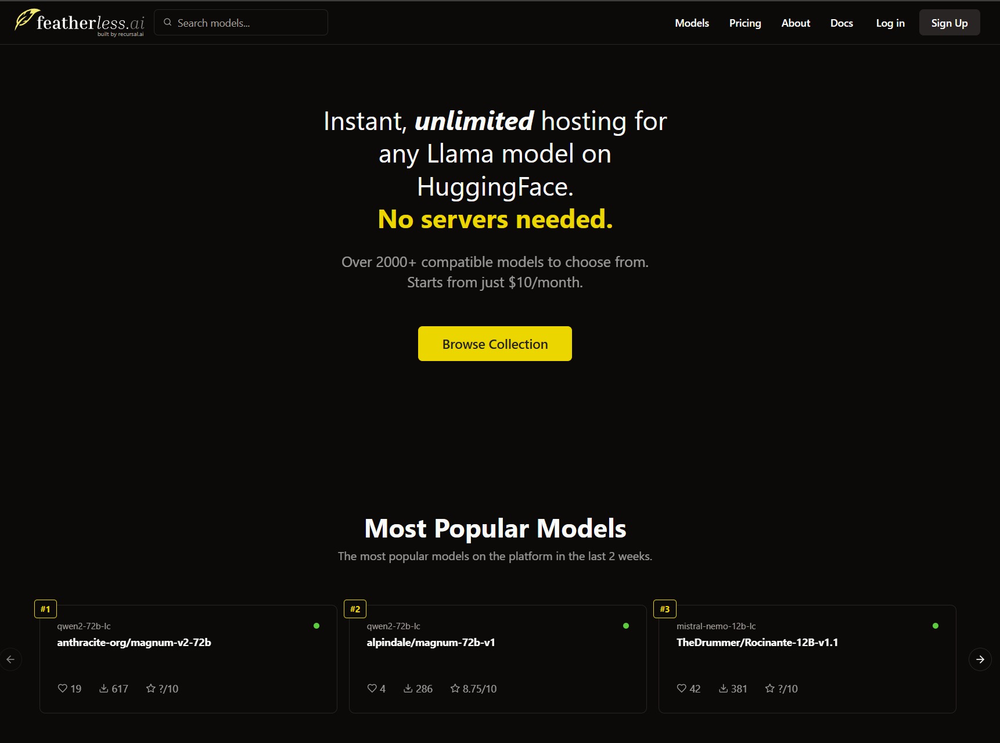
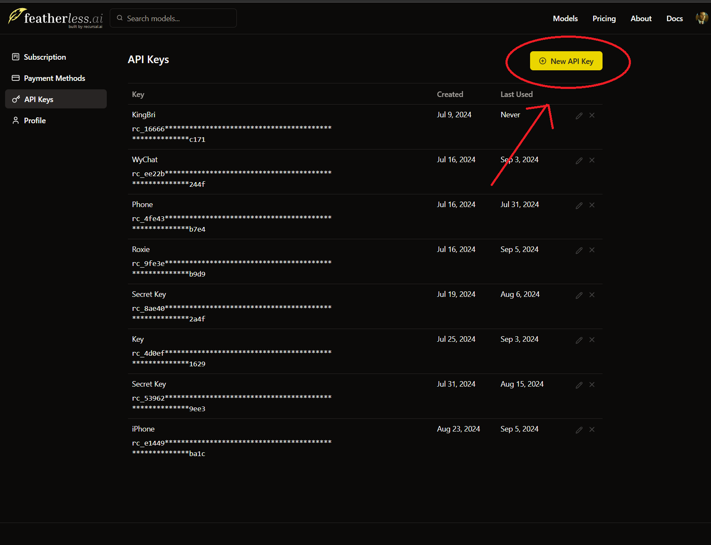
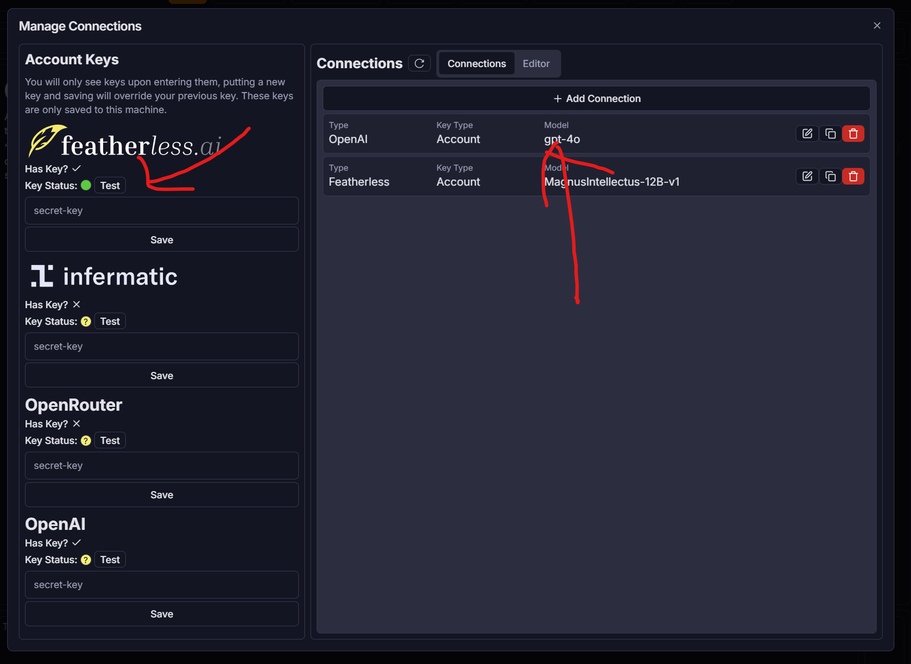
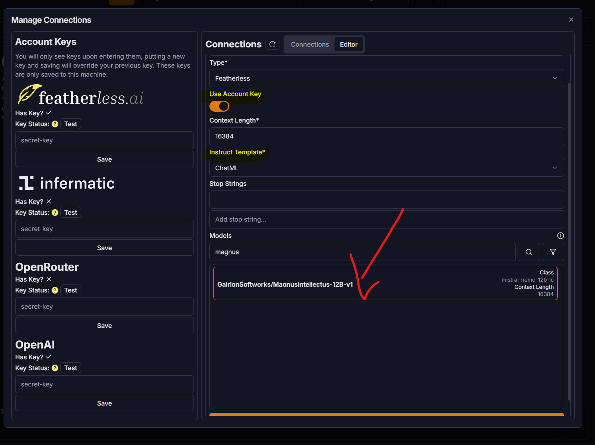

# Connections
In WyvernChat, you connect to one of many AI model providers. Each provider has its own set of models, which you can use to chat with. If you want to host your own models, we also offer the ability to enter your own API endpoint.
All connections are entered the same way, and are stored on a per-device basis, meaning you won't have synced connections across devices.
### Managing Connections
1. Go to any of the various mode pages in WyvernChat (Chat, Story, Scenario etc.)
2. If you're on mobile, activate the 'Settings' menu by tapping the gear icon in the top right corner. If you're on desktop, the settings menu is usually visible on the right side of the screen, if it isn't try toggling the button in the top right corner.
3. Navigate to the 'Settings' tab, or accordion, and scroll down to the 'Connections' section.
4. Click the 'Manage' button to open the connections manager.
> Desktop Connection Menu located in the Chat Mode.

> Mobile Connection Menu located in the Chat Mode.

5. If you're adding an API Key and want to avoid re-entering it, you can save it as an account key. This will allow you to use the same key across all connections on the device. Otherwise, you will enter your API inside of the 'Editor' for a connection.
> Manage Connections Menu located in the Chat Mode on Desktop.

From here, adding a connection differs based on the provider. Read further to see how to connect to each provider.
## Connection Types
Each connection type has its own set of models, and some have additional features. All non-personal connection types require an API key, which you can get from the provider's website. 
### Featherless AI
Featherless AI is a provider that, while not technically offering models directly, provides a catalog of models to use serverlessly. This has allowed Featherless to have well over 3000 language models available for use with a reasonable subscription cost attached.

To connect to Featherless AI, you will need to sign up for an account on their website [here](https://featherless.ai). Once you have an account, you can generate an API key to use in WyvernChat.\

6. (Optional) Enter your API key in the 'Editor' in the 'Featherless AI' account key section, and click 'Test' to ensure it works. It should show a green dot if it's successful.

7. Click 'Add Connection' to open the connection editor.

8. Select the 'Featherless' provider from the 'Type' dropdown.
9. Ensure the 'Account Key' switch is in the correct position depending on if you entered your key earlier.
10. If you've done everything correctly, you should see a list of models available to use. Find the model you want to use and click on it. 
11. It will autofill the name and context length field, but you must manually select an 'Instruct Template' which possibly can be determined by the model's class in the model list, or on the model's page on Featherless AI's website.
12. Click 'Create' to save the connection.
13. You should now see the connection in the 'Connections' section of the settings tab, ensure it is selected and pick a 'Settings Preset' before using the model.
### Infermatic AI
Coming Soon...
### OpenRouter
Coming Soon...
### OpenAI
Coming Soon...
### Custom OpenAI API
Coming Soon...