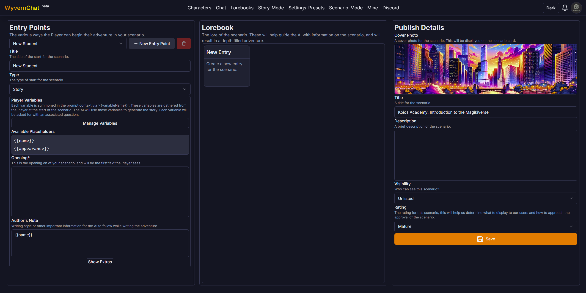

# Scenario Mode
Scenario Mode is the WyvernChat version of the 'AI Powered Text Adventure' concept popularized by AI Dungeon. The main difference is that WyvernChat offers the user the ability to publish potentially NSFW scenarios, as well as use completely community sourced backgrounds, assets, and an unfiltered connection to a multitude of AI Language Model providers.
## Creating a Scenario
First up, we've got the [Scenario Editor](https://app.wyvern.net/scenario/edit/new). 

This page is a WIP, but I like the desktop layout quite a bit. Mobile will always leave something to desired unless it's a native application (in my experience) but the editor will function just the same.
### Creating an Entry Point
Well, let's start with the obvious question; "Nevyn, what's an 'Entry Point'?"
Well dear reader, an 'Entry Point' is just the name I came up with for a sort of a Scenario Start. But, saying 'Scenario Starts' sounds stupid, so 'Entry Point' it is. Essentially, you can have as many of these as you want, and they're different ways for the player to start out their adventure in your world. You get a custom opening, author's note, instruct, player variables, etc. everything in that Entry Point tab is unique per Entry Point. This should let you create a world, and then assemble some different ways to jump into it. 
#### Player Variables
Each variable is summoned in the prompt context via `{{variableName}}`. These variables are gathered from the Player at the start of the scenario. The AI will use these variables to generate the story. Each variable will be asked for with an associated question.
You can put these `{{variableName}}` inside all of the following Entry Point fields and they will be replaced as the story is generated.
#### Opening

An opening is the very first thing the player sees when loading into a new log. Most of the time you want to write it in a Second Person perspective, sort of like this:

> As the sun sets over lake Michigan the city of Chicago feels just as alive as ever. The sounds of the street and the quiet foamy waves of the lake mingle together to create a vibrant tapestry of sound, the noise almost deafening. You look to your side and see

As you can see there, I left the last sentence unfinished. This is not required, but if done can allow the user to have a more unique start to your scenario.

#### Author's Note
